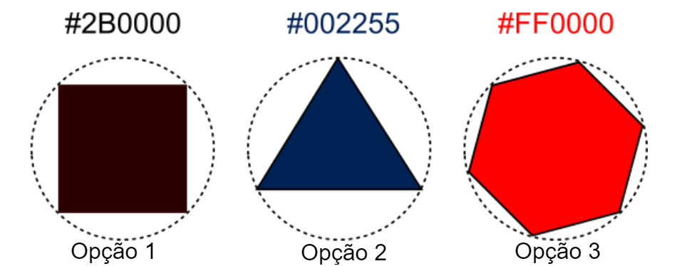
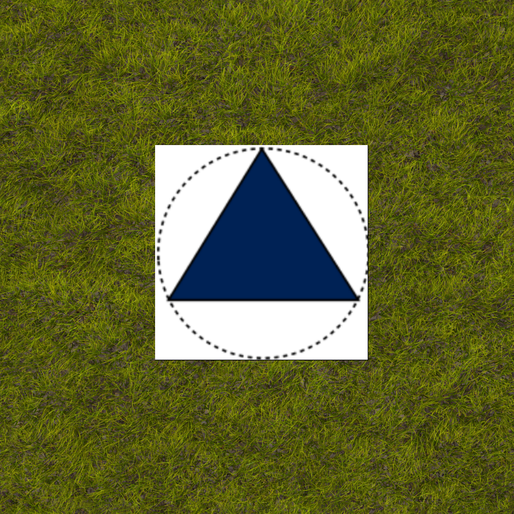

# Especificação Técnica: Visão Computacional

### Introdução
Nesse documento constam informações específicas sobre elementos da missão com os quais o drone terá que interagir. O objetivo é fornecer as especificações necessárias para a reprodução do ambiente da missão e, por consequência, para a simulação e testes da solução desenvolvida.

### Características do ambiente
O espaço que limita o ambiente da missão é quadrado e tem 30 metros por 30 metros de lado e um limite de 10 metros de altura, nesse espaço existe uma linha azul no chão, um QR Code e três bases que representam os pontos de entrega. O ambiente é plano com chão de grama baixa (não representa obstruções) e sem obstáculos, o chão oferece textura visual mas não possui referências adicionais além dos elementos citados.

### Linha para seguir
A linha a ser seguida pelo drone é uma linha azul, com largura de 20 cm, ela poderá fazer curvas, mas não poderá ter ângulos retos nem fará loops sobre si mesma. A linha não terá menos que 5 metros de comprimento nem e mais que 15.

### QR Code
O QR Code terá um código que traduza em "1", "2" ou "3", indicando qual base de pouso o drone deve seguir. O QR Code terá 100cm de lado e estará posicionado no chão. A base correta para o pouso será a unica na zona indicada pelo número do QR Code e as zonas de em que as bases de entrega podem estar terão cada uma 3 metros de lado e serão as seguintes:
- Zona 1: Centralizada em 3 metros para norte e 4 metros para oeste do QR Code
- Zona 2: Centralizada em 5 metros para norte do QR Code
- Zona 3: Centralizada em 3 metros para norte e 4 metros para leste do QR Code

### Alvos de auxílio
Os possíveis alvos de auxílio são identificados por bases individuais com figuras geométricas coloridas, cada base possui uma figura geométrica diferente e uma cor diferente como mostrado na imagem (formas geométricas regulares e a cor de cada em RGB codificada em Hexadecimal acima de cada representação), em todas elas a forma geométrica está inscrita numa circunferência de 80 cm de diâmetro que por sua vez está inscrita na base quadrada de também 80cm de lado. As bases estão posicionadas em locais pre-definidos de acordo com a indicação do QR Code. As cores e formas são as seguintes:

Uma base de exemplo na grama ficará assim:	

**Observação**: O circulo pontilhado é apenas uma referência para a circunferência que facilita a reprodução, não faz parte da base real.