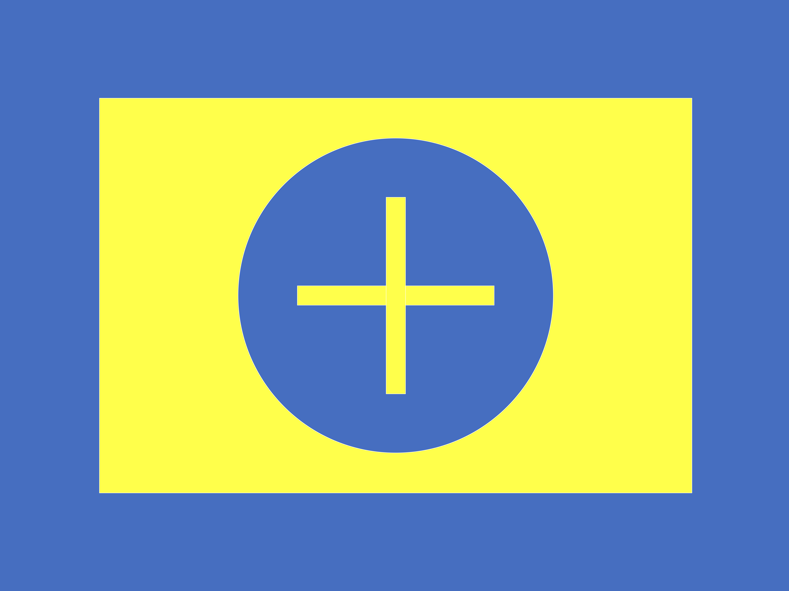

# 🛠️ Manual do Projeto Prático de Software - Trainee EDRA 2025.1

## Bem-vindo(a) ao Projeto Prático de Software!

Este manual detalha as opções de projeto para a área de software do processo trainee da equipe EDRA. Escolha **uma** das opções abaixo e siga as instruções para desenvolver seu projeto.

## Opções de Projeto Detalhadas

### 1️⃣ Opção 1: Visão Computacional para Detecção de Formas Geométricas Coloridas

**Objetivo:** Desenvolver um programa em Python com OpenCV para detectar features geométricos de uma base de pouso de drones com cores predefinidas em imagens ou vídeos. O projeto visa propor o estudo de conceitos fundamentais da visão computacional como o uso de filtros de imagem, operações no espaços de cores, transformações morfológicas, thresholding, detecção de bordas e criação e tipificação de contornos utilizando OpenCV.

**📚 Materiais de Estudo:**

*   **OpenCV Documentação e Tutoriais:**
    *   [Documentação Oficial OpenCV](https://docs.opencv.org/master/)
        *   **Uso:** Referência completa da biblioteca OpenCV, útil para pesquisa detalhada de funções e módulos.
    *   [Tutoriais OpenCV-Python](https://docs.opencv.org/4.x/d6/d00/tutorial_py_root.html) (Focar em: Basic Image Operations, Image Filtering, Morphological Transformations, Color Spaces, Image Thresholding, Contours e GUI Features).
        *   **Uso:** Guia prático com exemplos em Python, ideal para aprender os fundamentos do processamento de imagens com OpenCV. Concentre-se nos seguintes módulos:
            *   **Basic Image Operations:** Operações básicas como leitura, escrita e manipulação de pixels em imagens. Essencial para começar a trabalhar com imagens no OpenCV.
            *   **Image Filtering:** Técnicas para suavizar imagens, remover ruído e realçar bordas. Inclui filtros como Gaussian Blur e Median Blur, importantes para pré-processamento.
            *   **Morphological Transformations:** Operações morfológicas como erosão, dilatação, abertura e fechamento. Úteis para refinar formas geométricas detectadas e remover pequenos ruídos ou imperfeições.
            *   **Color Spaces:** Conversão entre diferentes espaços de cor (RGB, HSV, Gray). O espaço HSV é particularmente útil para segmentação de cores, pois separa a informação de cor (Hue) da intensidade (Value) e saturação (Saturation).
            *   **Image Thresholding:** Técnicas para segmentar imagens baseadas em limiares, criando imagens binárias. Essencial para isolar regiões de interesse baseadas em cor ou intensidade.
            *   **Contours:** Detecção e análise de contornos em imagens binárias. Funções como `findContours` e `approxPolyDP` são cruciais para identificar e aproximar formas geométricas.
            *   **GUI Features:** Ferramentas de Interface Gráfica do Usuário, como sliders e trackbars. Permitem criar interfaces interativas para ajustar parâmetros em tempo real.
    *   [Tutoriais de Processamento de Imagem OpenCV-Python](https://docs.opencv.org/4.x/d2/d96/tutorial_py_table_of_contents_imgproc.html)
        *   **Uso:** Tabela de conteúdos detalhada dos tutoriais de processamento de imagem em Python, facilitando a navegação por tópicos específicos.
    *   [Exemplo de interface com parâmetros para teste](https://cloudvision.app/image.html?rid=-M94KlEHAR6uSimUr61M)
        *   **Uso:** Referência visual de uma interface de usuário interativa para ajuste de parâmetros em um detector de formas geométricas. Demonstra uma sequência de operações de visão computacional e como os parâmetros podem ser controlados via interface.

*   **Conceitos Fundamentais:**
    *   **Filtros de Imagem:** Compreender filtros como Gaussian Blur, Median Blur para redução de ruído e suavização de imagens, facilitando a detecção de formas ao remover detalhes desnecessários e imperfeições.
    *   **Morfologia Matemática:** Estudar operações de erosão, dilatação, abertura e fechamento para refinar formas detectadas, remover ruídos menores, preencher lacunas em contornos e separar objetos que se tocam.
    *   **Segmentação por Cor:** Aprender a converter espaços de cor (RGB, HSV) e usar *thresholding* para isolar cores específicas, permitindo focar em regiões da imagem que correspondam às cores da base de pouso. O HSV é especialmente útil por separar a cor da luminosidade, tornando a detecção mais robusta a variações de iluminação.
    *   **Detecção de Contornos e Formas:** Utilizar `findContours` e `approxPolyDP` para detectar e aproximar contornos de formas geométricas, permitindo identificar as formas (círculos, quadrados, cruzes) presentes na base de pouso a partir dos contornos extraídos da imagem segmentada.

**🎯 Requisitos Funcionais:**

*   **Requisitos Obrigatórios:**
    1.  **Detecção de Formas Geométricas:** O programa deve detectar as formas geométricas básicas (círculos, quadrados, cruzes) contidas na base de pouso determinada (foto proporcional no corpo do texto, uma pasta com mais fotos de angulos diversos para exemplo será disponibilizada) em imagens e vídeos, o programa deve ser capaz de associar um contorno e um ponto central para cada detecção. A detecção pode ser das formas básicas individualmente ou do conjunto definido pela união delas.
    
      
    
    2.  **Parametrização dos argumentos usados:** As formas geométricas a serem detectadas devem ter cores específicas (e.g., círculos e cruzes amarelos, quadrados azuis ou quadrados amarelos etc), o programa deve lidar com isso internamente com parâmetros, assim como deve também parametrizar fatores fundamentais de filtros e qualquer argumento do tipo que for usada no código (permitir mudar em um unico lugar de maneira simples os valores usados, mesmo que atribua um valor padrão), tanto para a conveniência dos seus testes, para descobrir a configuração traz os melhores resultados, quanto para a demonstração que será feita.
    3.  **Interface de Usuário (UI) Básica:** Utilizar elementos de GUI (Interface Gráfica do Usuário) do OpenCV como sliders, select e afins para ajustar em tempo real parâmetros de filtros e algoritmos (limites HSV, tamanho do kernel, blur etc) usados, que foram criados de maneira conveniente para isso.
    4.  **Visualização:** Exibir a imagem original com as formas geométricas detectadas e contornadas, mostrando o tipo de forma e a cor detectada (texto sobreposto na forma ou na janela).

*   **Requisitos Opcionais (Escolher pelo menos 2):**
    1.  **Detecção em algum dataset próprio:** Criar um conjunto de fotos e vídeos (pode-se usar simplesmente a webcam ao vivo detectando numa tela ou numa impressão no papel) com uma réplica da base (pode ser em tamanho reduzido) esteja visível (é interessante criar diferentes condições para os testes) e validar o seu algoritmo para esse exemplo também.
    2.  **Reconhecimento de Formas Compostas:**  Em alternativa à deteção das formas geométricas básicas (círculo, quadrado e cruz) implementar um algoritmo que use a detecção dessas em conjunto para garantir a detecção com maior confiança (não detectar por confusão uma base onde não há ao detectar um quadrado no chão que não seja uma base por exemplo) ao usar, por exemplo, uma combinação das detecções das formas com os centros dentro de uma distância pequena o suficiente entre si para confirmar como um conjunto que represente a base (ao escolher essa opção deve-se demonstrar também separadamente o funcionamento da detecção de formas básicas).
    3.  **Medição de Distância:** Estimar em relação à posição da câmera a posição da base detectada. Ou faça isso para um dataset próprio usando as medidas que vpcê projetar para o lado da base e a amplitude da visão da câmera que usar ou, para as fotos fornecidas, use como referência 1m para o tamanho do lado da base e decida algum valor arbitrário para a amplitude do campo de visão da câmera para fins demonstrativos.
    4.  **Comparativo Entre Ferramentas/Algoritmos no Opencv:** Trazer um comparativo de diferentes opções disponíveis (dentre essas básicas usadas com o OpenCV) para implementar alguma etapa (filtro, método de segmentação por cor, método de extração de contorno, método de categorização de contorno etc) do algoritmo, fazer a demonstração de semelhanças e diferenças entre abordagens escolhidas para comparar e explicar na parte escrita algumas diferenças teóricas e dos resultados.
    5.  **Comparativo com Outros Métodos de Visão Computacional para essa Tarefa:** Trazer o comparativo do uso dos métodos básicos, como eles estão propostos na parte principal da atividade, com métodos de aprendizado de máquina como redes neurais convolucionais usadas em sistemas como o [YOLO](https://docs.ultralytics.com/), para isso deve-se treinar algum modelo de aprendizado de máquina (no sistema da sua escolha), fazer a demonstração comparando ao com OpenCv e explicar na parte escrita algumas diferenças teóricas e dos resultados.

**✅ Checklist de Desenvolvimento:**

*   [ ] Configurar o ambiente Python com OpenCV.
*   [ ] Estudar a documentação e tutoriais de OpenCV sobre filtros, morfologia, cores e detecção de contornos.
*   [ ] Implementar a detecção básica de formas geométricas e cores em imagens estáticas.
*   [ ] Adicionar sliders para ajuste de parâmetros de cor.
*   [ ] Implementar a visualização das formas detectadas.
*   [ ] Implementar pelo menos dois requisitos opcionais.
*   [ ] Testar o programa com diferentes imagens e vídeos.
*   [ ] Documentar o código e preparar a apresentação.
*   [ ] Criar a documentação/relatório do projeto em forma de README.

### 2️⃣ Opção 2: Criação de Missões Paramétricas em Simulação ROS2/PX4

**Objetivo:** Desenvolver missões de navegação autônoma configuráveis por parâmetros no ambiente de simulação ROS2/PX4. O projeto visa aprofundar o entendimento de ROS2, PX4 e Gazebo, focando na criação de missões flexíveis e no monitoramento de dados via terminal.

**📚 Materiais de Estudo:**

*   **Docker e PX4:**
    *   [Documentação Docker da PX4](https://docs.px4.io/main/en/test_and_ci/docker.html#px4-docker-containers)
    *   [Playlist: Como iniciar e integrar o Docker da PX4](https://youtube.com/playlist?list=PL7a-3FhE-c6uZiyj6TvCFqZ2jU9ETwNpH&si=SnUcXjKjvrcK6vWn)
*   **ROS2 e Integração PX4:**
    *   [Documentação geral de ROS2 na PX4](https://docs.px4.io/main/en/ros2/)
    *   [Interface de navegação com ROS2](https://docs.px4.io/main/en/ros2/px4_ros2_navigation_interface.html)
*   **ROS2 Tutoriais Gerais:**
    *   [ROS2 Tutorials](https://docs.ros.org/en/iron/Tutorials.html) (Focar em "Understanding ROS2 nodes", "Topics", "Services", "Actions", "Writing a simple publisher and subscriber", "Using parameters")
*   **Conceitos Fundamentais:**
    *   **ROS2 Nodes, Topics, Services, Actions, Parameters:** Compreender a arquitetura ROS2 e como os nós se comunicam usando tópicos, serviços e actions, e como configurar parâmetros em nós ROS2.
    *   **Simulação PX4/Gazebo:**  Familiarizar-se com o ambiente de simulação PX4 no Gazebo, incluindo a execução de simulações e a interação com o drone simulado.
    *   **MAVLINK e PX4_msgs:** Entender as mensagens MAVLINK e PX4\_msgs utilizadas para comunicação com o PX4 e como monitorar dados relevantes (e.g., posição, attitude) através de tópicos ROS2.

**🎯 Requisitos Funcionais:**

*   **Requisitos Obrigatórios:**
    1.  **Simulação ROS2/PX4:** Configurar e executar a simulação de um drone no Gazebo utilizando Docker da PX4 e integração ROS2.
    2.  **Missões Paramétricas:** Desenvolver um nó ROS2 em Python que permita criar missões de navegação autônoma básicas (decolar, voar para um ponto, pousar) configuráveis através de parâmetros ROS2 (e.g., destino, altura de voo, velocidade). Os parâmetros devem ser definidos no launch file ou via linha de comando.
    3.  **Monitoramento via Terminal:**  Implementar a leitura e exibição de dados de telemetria do drone (posição X, Y, Z) em tempo real no terminal, utilizando `ros2 topic echo`.
    4.  **Documentação da Missão:** Documentar os parâmetros configuráveis da missão, os tópicos ROS2 utilizados para monitoramento e os passos para executar e configurar a simulação.

*   **Requisitos Opcionais (Escolher pelo menos 2):**
    1.  **Tipos de Trajetória Parametrizáveis:**  Expandir as missões para incluir diferentes tipos de trajetória parametrizáveis (e.g., voo em círculo com raio e centro configuráveis, voo em linha reta com comprimento e direção configuráveis).
    2.  **Variáveis de Controle Parametrizáveis:**  Permitir configurar parâmetros de controle da missão (e.g., velocidade máxima, taxa de subida/descida) via parâmetros ROS2.
    3.  **Dashboard Web Básico (Streamlit):** Criar um dashboard web básico com Streamlit para visualizar os dados de telemetria do drone (posição, altura) de forma gráfica e interativa.
    4.  **Serviço ROS2 para Configuração:** Criar um serviço ROS2 que permita configurar os parâmetros da missão dinamicamente (sem precisar reiniciar o nó ROS2).
    5.  **Testes com Diferentes Parâmetros:**  Realizar testes da simulação com diferentes configurações de parâmetros e documentar os resultados e observações sobre o comportamento do drone.

**✅ Checklist de Desenvolvimento:**

*   [ ] Instalar Docker e configurar o ambiente PX4 com ROS2.
*   [ ] Estudar a documentação de ROS2 e PX4, focando em parâmetros, navegação e simulação.
*   [ ] Criar um pacote ROS2 e um nó de controle em Python para missões paramétricas.
*   [ ] Implementar missões básicas configuráveis por parâmetros no Gazebo.
*   [ ] Monitorar dados de telemetria no terminal usando `ros2 topic echo`.
*   [ ] Implementar pelo menos dois requisitos opcionais.
*   [ ] Documentar o código, parâmetros e preparar a apresentação.

### 3️⃣ Opção 3: Planejamento de Missão com Máquina de Estados ou Árvore de Comportamento

**Objetivo:** Desenvolver um sistema de planejamento de missão para um drone, utilizando Máquina de Estados Finita (FSM) ou Árvore de Comportamento (Behavior Tree - BT) para lógica de decisão e controle. O projeto foca na implementação da lógica de planejamento e na justificativa das escolhas de design, sem a necessidade de simulação em Gazebo (testes automatizados opcionais).

**📚 Materiais de Estudo:**

*   **Máquinas de Estados e Árvores de Comportamento:**
    *   [python-statemachine (GitHub)](https://github.com/fgmacedo/python-statemachine): Biblioteca Python para Máquinas de Estados Finitas.
    *   [py\_trees (GitHub)](https://github.com/splintered-reality/py_trees): Biblioteca Python para Árvores de Comportamento.
    *   [Artigo sobre Máquinas de Estados em Robótica](pesquisar no Google por "state machine robotics tutorial")
    *   [Artigo sobre Árvores de Comportamento em Robótica](pesquisar no Google por "behavior tree robotics tutorial")
*   **Conceitos Fundamentais:**
    *   **Máquinas de Estados Finitas (FSM):**  Entender o conceito de estados, transições e eventos em FSMs, e como modelar o comportamento de um sistema usando FSMs.
    *   **Árvores de Comportamento (BT):**  Entender a estrutura hierárquica de BTs, nós de controle (sequência, seletor), nós de ação e nós de condição, e como usar BTs para planejamento de comportamento complexo.
    *   **Planejamento de Missão:**  Conceituação de missões autônomas, etapas de uma missão típica de drone (decolagem, navegação, pouso), e lógica de decisão para lidar com diferentes situações e eventos durante a missão.

**🎯 Requisitos Funcionais:**

*   **Requisitos Obrigatórios:**
    1.  **Implementação de FSM ou BT:** Escolher e implementar um sistema de planejamento de missão usando Máquina de Estados Finita (com `python-statemachine`) **ou** Árvore de Comportamento (com `py_trees`).
    2.  **Missão Seguidor de Linha:** A missão a ser planejada deve ser um "seguidor de linha" que leve o drone de um ponto inicial até uma localização de pouso em uma base específica. A base de pouso será identificada por um identificador predefinido (dentre outras bases possíveis).
    3.  **Justificativa de Escolhas:** Documentar e justificar as escolhas de design e implementação do sistema de planejamento (FSM ou BT), incluindo a estrutura de estados/nós, as transições/fluxo de controle, e o tratamento de eventos e condições.
    4.  **Testes em Ambiente Simulado (Texto/Console):**  Desenvolver um ambiente de teste simulado em texto/console para demonstrar o funcionamento da lógica de planejamento. O simulador deve permitir simular o progresso da missão, a detecção da linha, a identificação da base e o pouso.

*   **Requisitos Opcionais (Escolher pelo menos 2):**
    1.  **Reação a Eventos Simulados:** Expandir o sistema de planejamento para reagir a eventos simulados (e.g., perda da linha, obstáculos, vento simulado), alterando o comportamento do drone (e.g., busca pela linha, desvio de obstáculo, espera por melhores condições).
    2.  **Planejamento de Rota Básico (em FSM/BT):** Integrar um algoritmo simples de planejamento de rota (e.g., linha reta, busca em espiral) dentro da FSM ou BT para gerar a trajetória do seguidor de linha dinamicamente.
    3.  **Testes Automatizados (Cadeia de Markov - Opcional Avançado):** Implementar um sistema de testes automatizados utilizando um modelo de Cadeia de Markov para avaliar a robustez e eficiência do sistema de planejamento em diferentes cenários simulados (e.g., variações no ambiente, falhas de detecção).
    4.  **Visualização da FSM/BT:** Criar uma representação visual da Máquina de Estados ou Árvore de Comportamento (e.g., diagrama gerado automaticamente pela biblioteca ou desenhado manualmente) para facilitar a compreensão da lógica de planejamento.
    5.  **Interface de Monitoramento (Terminal/Texto):**  Melhorar a interface de teste em texto/console para monitorar o estado atual da FSM/BT, eventos, transições e outras informações relevantes durante a simulação.

**✅ Checklist de Desenvolvimento:**

*   [ ] Estudar o conceito de Máquinas de Estados Finitas ou Árvores de Comportamento e as bibliotecas Python correspondentes.
*   [ ] Projetar a arquitetura do sistema de planejamento (FSM ou BT) para a missão seguidor de linha.
*   [ ] Implementar a FSM ou BT em Python, utilizando a biblioteca escolhida.
*   [ ] Desenvolver um ambiente de teste simulado em texto/console.
*   [ ] Testar o sistema de planejamento no ambiente simulado.
*   [ ] Documentar as escolhas de design, a implementação e os testes.
*   [ ] Implementar pelo menos dois requisitos opcionais.
*   [ ] Preparar a apresentação, focando na explicação da lógica de planejamento e justificativas.

---

## 🎯 Avaliação Geral dos Projetos

A avaliação dos projetos de software considerará os seguintes critérios:

1.  **Funcionalidade e Cumprimento dos Requisitos:** O projeto atende aos requisitos obrigatórios e opcionais escolhidos? Funciona conforme o esperado?
2.  **Qualidade do Código:** O código é bem organizado, legível, comentado e segue boas práticas de programação (quando aplicável à linguagem)?
3.  **Documentação e Explicação Técnica:** A documentação (código e relatórios concisos, quando aplicável) é clara e suficiente para entender o projeto? O candidato demonstra compreensão técnica do projeto durante a apresentação e consegue responder a dúvidas?
4.  **Criatividade e Iniciativa (Requisitos Opcionais):** A escolha e implementação dos requisitos opcionais demonstram iniciativa e exploração além do básico?
5.  **Justificativa de Design (Opção 3):** Para a Opção 3, a justificativa das escolhas de design da Máquina de Estados ou Árvore de Comportamento é clara, lógica e bem fundamentada?

## 🗂️ Recursos e Referências Adicionais

*   [ROS2 Documentation](https://docs.ros.org/en/): Documentação oficial ROS2.
*   [PX4 Documentation](https://docs.px4.io/): Documentação PX4.
*   [OpenCV Documentation](https://docs.opencv.org/master/): Documentação oficial OpenCV.
*   [Streamlit Documentation](https://docs.streamlit.io/): Documentação Streamlit (para interface web opcional).
*   [python-statemachine (GitHub)](https://github.com/fgmacedo/python-statemachine)
*   [py\_trees (GitHub)](https://github.com/splintered-reality/py_trees)

---

**Boa sorte com o seu projeto!** Em caso de dúvidas, entre em contato com a equipe de software.